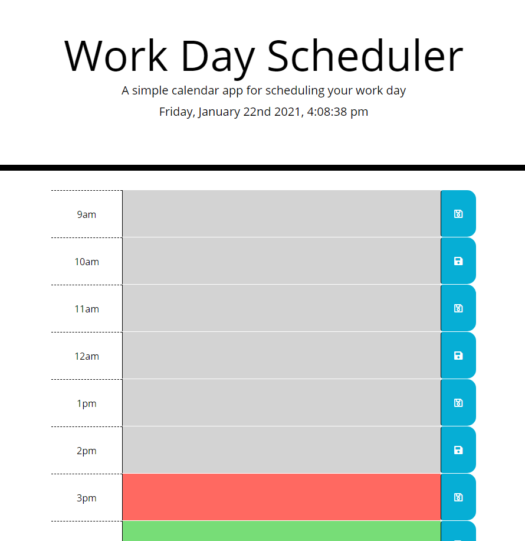

# work-day-planner

## Table of Contents 

* [Installation](#installation)
* [Html changes](#html-changes)
* [CSS changes](#css-changes)
* [JavaScript changes](#javascript-changes)
* [Link to site](#link-to-site)
* [Screenshot](#screenshot-of-landing-page)
* [Credits](#credits)
* [License](#license)

I finished this project using some existing code provided to develop a work day scheduler so as to provide an employee with the opportuniy to plan the day and to help make them more productive. The planner allows for the user to add mutiple task for each hour of the work day; the scheduler uses work hours from 9 to 5. At the start of the work day at 9 am the block will be red and upcoming hours will be green. As the hours progress the red block hour will indicate the working hour or active hour of the day. Past hours will start showing with a gray background and upcoming hours will continue to show up as green. When the user inputs there information into an hour block they have the option to save and store the information and it will be stored with the abilty to open in another tab or be refreshed without losing there information. Lastly they can change the existing information they have saved and edit it and save the new changes.

We used bootstrap and font awesome to help us with styles on this and moment for the date, time, clock aspects.

## Installation

Click the link to site in this README and it will take you to the landing page for the site. 

## Html changes

// Html changes //

Installed timeblocks for the hours, description, and save. This was done with rows and colums; any changes in the future will be updated here...

## CSS changes
/* CSS changes */ 

Styles provided were sufficent; any changes in the future will be updated here...

## JavaScript Changes

JavaScript along with implementing jquery is were we implemented all the working of the scheduler so the information could be inputted, saved, stored, recalled, and edited when needed. 

## Link to site

https://lewisoutdoorllc.github.io/work-day-planner/

Link to GitHub Repo
https://github.com/lewisoutdoorllc/work-day-planner

## Screenshot of landing page

## Credits

Thanks for all the help from Kip, other classmates, Nick, and Carlos on this little venture for making this happen.. Always fun!! Cheers..

//  Links that helped get to the proper conclusion for providing the solutions to our users requirements..

## License

Copyright (c) 2012-2020 Scott Chacon and others

Permission is hereby granted, free of charge, to any person obtaining
a copy of this software and associated documentation files (the
"Software"), to deal in the Software without restriction, including
without limitation the rights to use, copy, modify, merge, publish,
distribute, sublicense, and/or sell copies of the Software, and to
permit persons to whom the Software is furnished to do so, subject to
the following conditions:

The above copyright notice and this permission notice shall be
included in all copies or substantial portions of the Software.

THE SOFTWARE IS PROVIDED "AS IS", WITHOUT WARRANTY OF ANY KIND,
EXPRESS OR IMPLIED, INCLUDING BUT NOT LIMITED TO THE WARRANTIES OF
MERCHANTABILITY, FITNESS FOR A PARTICULAR PURPOSE AND
NONINFRINGEMENT. IN NO EVENT SHALL THE AUTHORS OR COPYRIGHT HOLDERS BE
LIABLE FOR ANY CLAIM, DAMAGES OR OTHER LIABILITY, WHETHER IN AN ACTION
OF CONTRACT, TORT OR OTHERWISE, ARISING FROM, OUT OF OR IN CONNECTION
WITH THE SOFTWARE OR THE USE OR OTHER DEALINGS IN THE SOFTWARE.